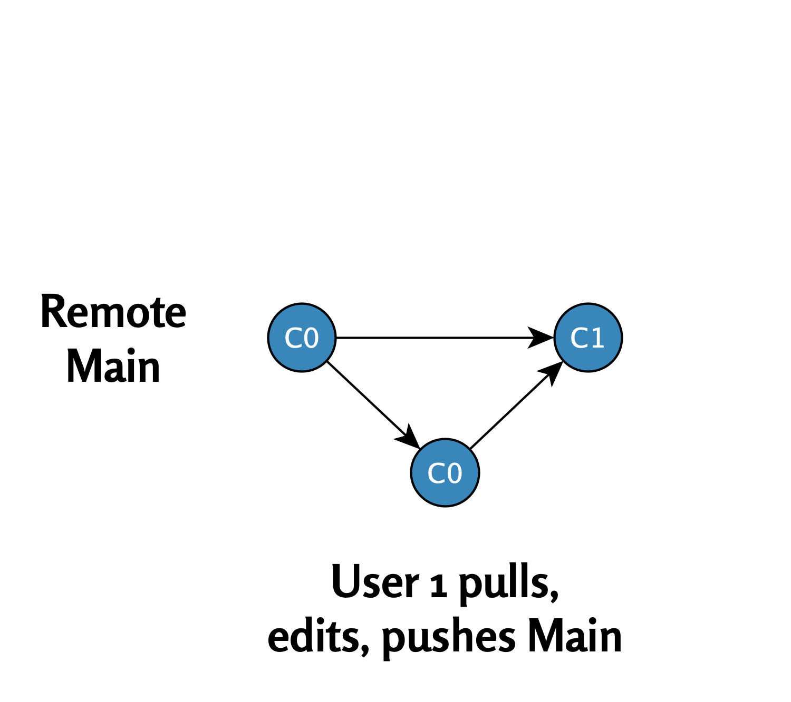

# Ongelmaton päähaara

Tässä luvussa tarkastelemme yksinkertaista esimerkkiä, jossa kaksi käyttäjää työskentelee päähaarassa ilman ristiriitoja. Näemme, miten muutokset kulkevat loogisesti ja ilman ongelmia Gitin avulla.

## Tilanne: Remote Main (C0)

Työ alkaa etähakemistossa olevasta päähaarasta, jossa viimeisin tilanne on commit `C0`.\
Etähakemistoa kuvaa seuraava kaavio:

{width="468"}

## Käyttäjä 1: Pull (C0)

**Pull**: Käyttäjä 1 lataa uusimmat tiedot etähakemistosta (`C0`) paikalliseen hakemistoonsa.

{width="450"}

## Käyttäjä 1: muokkaus ja push (C1)

1.  **Muokkaus**: Käyttäjä 1 muokkaa tiedostoja ja tekee commitin `C1`.
2.  **Push**: Muutokset päivitetään takaisin etähakemistoon.

Tilanne etähakemistossa commitin `C1` jälkeen:

{width="450"}

 

## Käyttäjä 2: Pull (C1)

**Pull**: Käyttäjä 2 lataa commitin `C1` paikalliseen hakemistoonsa.

 

{width="518"}

## Käyttäjä 2: muokkaus ja push (C2)

1.  **Muokkaus**: Käyttäjä 2 muokkaa tiedostoja ja tekee commitin `C2`.
2.  **Push**: Muutokset päivitetään takaisin etähakemistoon.

Tilanne etähakemistossa commitin `C2` jälkeen:

 

{width="516"}

 

## Yhteenveto

Tässä yksinkertaisessa esimerkissä molemmat käyttäjät työskentelivät päähaarassa ilman ristiriitoja. Jokainen vaihe seuraa loogisesti toistaan: pull → muokkaus → commit → push.

------------------------------------------------------------------------

Seuraavassa luvussa tarkastelemme tilannetta, jossa molemmat käyttäjät muokkaavat commitia `C0` samanaikaisesti. Tämä voi johtaa divergent-haaroihin ja konfliktien ratkaisuun.

 

<a property="dct:title" rel="cc:attributionURL" href="https://vldesign.kapsi.fi/r/">R-opas</a> by <a rel="cc:attributionURL dct:creator" property="cc:attributionName" href="http://www.linkedin.com/in/ville-langen">Ville Langén</a> is licensed under <a href="http://creativecommons.org/licenses/by-sa/4.0/?ref=chooser-v1" target="_blank" rel="license noopener noreferrer" style="display:inline-block;">Attribution-ShareAlike 4.0 International</a>

